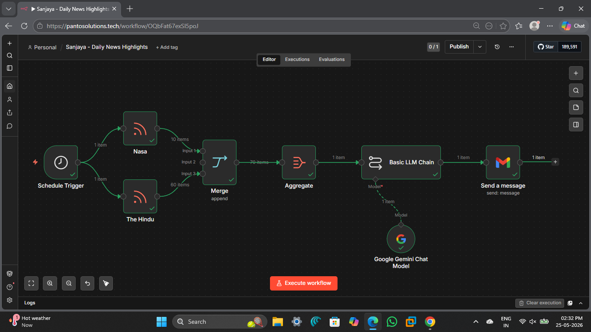

# 📰 Sanjaya - Daily News Highlights

An AI-powered automated news newsletter workflow built using **n8n**, **Google Gemini AI**, **RSS feeds**, and **Gmail integration**.

This project automatically collects the latest news from multiple sources, summarizes them using AI, and sends a clean daily news highlights email.

---

# 🚀 Features

* 📰 Fetches latest news from multiple RSS feeds
* 🤖 Uses Google Gemini AI for intelligent news summarization
* 📧 Automatically sends a formatted email newsletter
* ⏰ Runs on schedule every day
* 🔄 Fully automated workflow using n8n

---

# 🛠️ Technologies Used

* **n8n** → Workflow automation
* **Google Gemini AI** → AI summarization
* **RSS Feeds** → News collection
* **Gmail API** → Email delivery

---

# ⚙️ Workflow Overview

The workflow performs the following steps:

1. **Schedule Trigger**

   * Automatically starts the workflow every day at a fixed time.

2. **RSS Feed Collection**

   * Collects news articles from:

     * NASA Breaking News
     * The Hindu Sports News

3. **Merge Node**

   * Combines all fetched news data into a single stream.

4. **Aggregate Node**

   * Aggregates all news articles together.

5. **Google Gemini AI**

   * Summarizes the news articles into a readable newsletter format.

6. **Gmail Integration**

   * Sends the summarized news directly to email.

---

# 📌 Email Format

The generated newsletter includes:

* News source name
* Headline
* Published date
* AI-generated summary
* Article link

---

# 📷 Workflow Preview

---

# 🎯 Purpose of This Project

This is my very first automation + AI project created while learning workflow automation and artificial intelligence.

The goal of this project was to:

* Learn automation workflows
* Understand AI integration
* Work with APIs and RSS feeds
* Build a real-world practical project

---

# 🔮 Future Improvements

* Add more news sources
* Create category-wise summaries
* Telegram/Discord integration
* Web dashboard for viewing news
* Multi-language support

---

# 📚 Learning Outcome

Through this project, I learned:

* Basics of workflow automation
* AI-powered text processing
* API integrations
* Email automation
* Real-world project structuring

---

# 🙌 Acknowledgement

Special thanks to my brother for constantly motivating and guiding me throughout this project journey. His support helped me think beyond just learning theory and start building real-world projects early.

---

# ⭐ Final Note

This project may be small, but it marks the beginning of my journey into technology, AI, and automation 🚀
